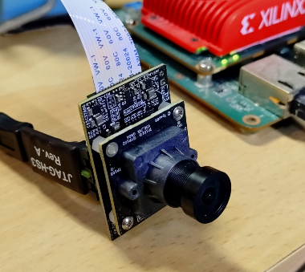

Japanese version: [README.md](README.md)

# Global-Shutter MIPI High-Speed Camera (PYTHON300 + Spartan-7)

## Overview

This repository provides schematics only for the global-shutter MIPI high-speed camera introduced here:
https://rtc-lab.com/products/rtcl-cam-p3s7-mipi/

This is a compact camera module for research and development built around the onsemi
[PYTHON300 image sensor](https://www.onsemi.jp/products/sensors/image-sensors/python300)
and an AMD (Xilinx) [Spartan-7 FPGA](https://www.amd.com/ja/products/adaptive-socs-and-fpgas/fpga/spartan-7.html).

While the datasheet lists VGA resolution, it also specifies up to 815 fps. In our setup, when connected to
an [KV260](https://www.amd.com/ja/products/system-on-modules/kria/k26/kv260-vision-starter-kit.html)
and a [Zybo Z7](https://digilent.com/shop/zybo-z7-zynq-7000-arm-fpga-soc-development-board/),
we achieved 1000 fps at 320×320 resolution.

Sample footage and additional details are also available on the product page above.

## Schematics

The schematics are provided as follows:

- [Image sensor sub-board](sensor_python300.pdf)
- [FPGA main board](mipi_spartan7.pdf)

## PCB Design Data

KiCad project sources are published separately here:
https://github.com/ryuz/rtcl-p3s7-mipi-pcb

## License

The schematics and other files in this repository are distributed under the MIT License.

## Board Sales

Manufactured boards are available on BOOTH:

- [Monochrome version](https://rtc-lab.booth.pm/items/7427869)
- [Color version](https://rtc-lab.booth.pm/items/7428802)

## Related Software

At present, there is a project that transmits data in a custom format to the KV260.

- [Spartan-7 design](https://github.com/ryuz/rtcl-designs/tree/main/projects/rtcl_p3s7_mipi/rtcl_p3s7_mipi)
- [KV260 design](https://github.com/ryuz/rtcl-designs/tree/main/projects/kv260/kv260_rtcl_p3s7_hs)
- [Zybo Z7 design](https://github.com/ryuz/rtcl-designs/tree/main/projects/zybo_z7/zybo_z7_rtcl_p3s7_hs)

## Author

Ryuji Fuchikami  
[Real-Time Computing Laboratory](https://rtc-lab.com/)
